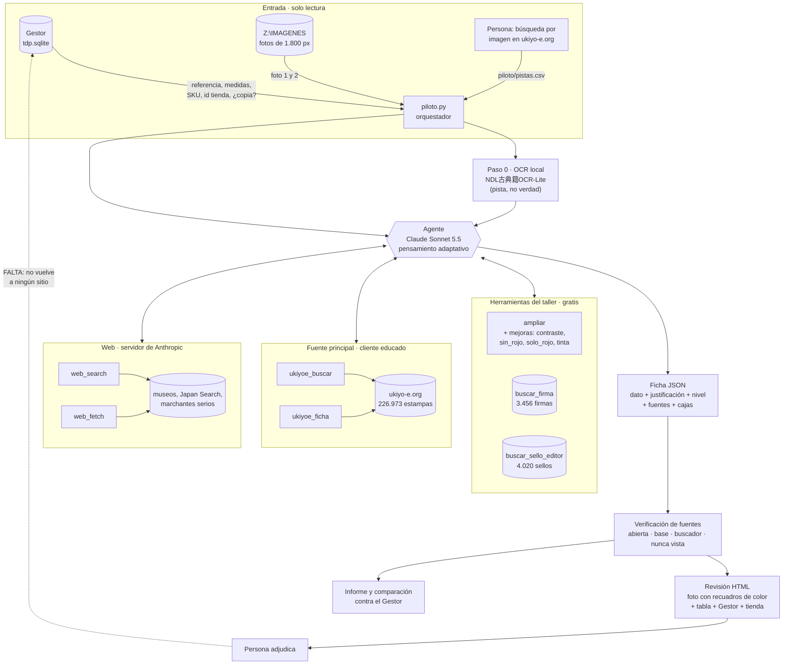

# CATALOGADOR · análisis crítico del sistema · 08/10/2026

> Superado en parte por `05_version_depurada.md` (09/10/2026): ficha esencial, dos fases, memoria de series, lo publicable y el horario.

Pedido por la casa: cómo funciona y cómo está consolidado, con detalle y crítica; qué fuentes
usa; evaluación de todo lo analizado; cuándo sería más barato; cómo leer mejor caracteres
japoneses antiguos, también en fotos pobres o papel dañado; justificación y recuadros por dato;
y revisión de los vínculos SKU e id con las obras.

## 1. Cómo funciona hoy (v3)

### Por pasos

1. **Entrada.** De la base del Gestor, abierta en solo lectura: referencia, medidas y rutas de foto. Ahora también el id de la tienda, el SKU y si la ficha se creó como copia de otra. No recibe artista ni título.
2. **OCR local.** El OCR de japonés antiguo de la Biblioteca Nacional de la Dieta lee la foto entera en el PC, en unos 9 s y sin coste.
3. **Agente.** Claude Sonnet 5.5 recibe fotos, lectura del OCR, medidas y, si las hay, las pistas que una persona encontró a mano. Trabaja en bucle con siete herramientas:
   - **Del taller, gratis:** la lupa con mejoras de imagen, la base de firmas y la base de sellos de editor.
   - **ukiyo-e.org**, por un cliente que espera entre 20 y 35 s entre peticiones.
   - **Búsqueda y lectura web** del servidor de Anthropic.
4. **Ficha.** Cada dato principal lleva justificación (cómo y por qué), nivel de fiabilidad, fuentes y recuadros sobre la foto.
5. **Verificación.** Cada URL citada se clasifica según cómo llegó a ella el agente.
6. **Revisión.** Una página local con la foto anotada en colores, la tabla con los mismos colores, la comparación con el Gestor y los datos de la tienda.

### Qué está consolidado y qué no

| Pieza | Estado |
|---|---|
| Lectura del Gestor y de Z: en solo lectura | Sólida. Probada en 70 obras. |
| OCR de la NDL como pista | Sólida, con límite conocido (ver §4). |
| Lupa y mejoras de imagen | Construida. Las mejoras se estrenan en la v3. |
| Bases de firmas y sellos | Sólidas como cotejo de texto. No cotejan la **forma** del sello. |
| ukiyo-e.org | Construida en la v3. Solo búsqueda de texto y fichas; la búsqueda por imagen es manual. |
| Justificación, nivel y recuadros | Construida en la v3. Depende de que el modelo dé cajas precisas. |
| Verificación de fuentes | Construida. Las pasadas anteriores solo se pueden verificar en parte. |
| Vuelta de lo adjudicado al sistema | **No existe.** Es el hueco más grande (§7). |
| Conjunto de oro para medir | **No existe.** Medimos contra el Gestor, que se equivoca. |

## 2. Las fuentes que usa, en orden de fiabilidad

| Nivel | Fuente | Cómo se usa | Reglas |
|---|---|---|---|
| 1 | **ukiyo-e.org** (226.973 estampas de museos y marchantes) | `ukiyoe_buscar` y `ukiyoe_ficha` por `ukiyoe.py`. Las fichas traen título, artista con kanji, fecha, enlace al museo y estampas parecidas con su porcentaje. | Solo lo que permite su robots.txt: `/search` y `/image/`. Entre 20 y 35 s entre peticiones, también entre hilos y procesos. Tope de 400 al día. Caché permanente. Ante un 403, 429 o 5xx se para hasta el día siguiente. **La búsqueda por imagen (`/upload/`) está prohibida en su robots.txt**: la hace una persona y deja el enlace en `piloto/pistas.csv`. |
| 2 | **Museos** (MFA Boston, Metropolitan, Art Institute of Chicago, British Museum, Rijksmuseum, Library of Congress, Honolulu, Minneapolis, Waseda, Tokyo Metropolitan Library, Museo Edo-Tokio, Biblioteca Nacional de la Dieta, Japan Search, ColBase) | Búsqueda y lectura web del servidor. | El MFA devuelve 403 a los lectores automáticos: sus datos llegan bien a través de ukiyo-e.org, que enlaza la ficha original. |
| 3 | **Base de firmas** (Ukiyo-e Signature Sample Database, ukiyoesig.net): 3.456 firmas de 2.145 nombres | `buscar_firma`, local. | Descargada una vez. Equipara formas antiguas y modernas (國/国, 樓/楼). |
| 3 | **Base de sellos de editor** (Ukiyo-e Publisher Seal Database, ukiyoesig.net): 4.020 sellos de 1.235 editores, formas de Marks | `buscar_sello_editor`, local. | Descargada una vez. Coteja el texto del sello, no su forma. |
| 3 | **Tabla de censores y fechas**, 1790–1876 | En el prompt. | Estática. |
| 4–5 | **Especializadas y marchantes**: hiroshigeii.net, kuniyoshiproject.com, kunisada.de, kabuki21.com, la exposición Kunisada y Kabuki del Fitzwilliam, la base de nishiki-e del Teatro Nacional de Japón, Scholten, artelino, Fuji Arts, Egenolf, Ronin | Búsqueda y lectura web. | Útiles para series y contexto; no para el título de una hoja concreta salvo misma composición. |
| — | **OCR** NDL古典籍OCR-Lite | Paso 0, local. | Pista; nunca fuente. |
| Fuera | Artnet, Artprice, MutualArt, Askart, Invaluable, LiveAuctioneers | Bloqueadas. | De pago o prohíben la extracción. |
| Fuera | Base del ARC de Ritsumeikan (dh-jac.net) | Bloqueada. | Sin API ni permiso. |
| Fuera | tallerdelprado.com | Bloqueada. | Copiar nuestra propia ficha sería circular. |

## 3. Evaluación de todo lo analizado

### Lo medido

| Pasada | Obras | Coste por obra |
|---|---|---|
| v1, primera prueba | 1 | 0,29 € |
| Referencia, sin OCR ni lupa | 50 | 0,24 € |
| v2, OCR + lupa + sellos | 50 | 0,57 € |
| v2 sobre obras sin identificar | 20 | 0,48 € |
| v2 con verificación en ukiyo-e.org | 2 | 0,92 € |
| **v3**, 13 obras difíciles o discutidas | 13 | 0,86 € |

Sobre las 50 de la muestra, contra el Gestor:

| Campo | Referencia | v2 | Lectura crítica |
|---|---|---|---|
| Artista | 48/50 | 47/50 | Muy bueno. Con confianza alta, 39 de 40. De los fallos, uno es error del Gestor (TDP-007990). |
| Serie con confianza alta | 29/50 | 41/50 | Bueno, y es lo que más mejora el OCR. |
| Año (±2) | 47/50 | 49/50 | Muy bueno. |
| Editor | 27/50 | 33/50 | **Débil.** Con confianza alta o media, 31 de 40: un 22 % de error cuando se atreve. |
| Título de la hoja | sin medir | sin medir | **Débil.** Casi siempre vacío o descriptivo: solo sale cuando aparece la misma composición en una ficha. |

### Fiabilidad, con crítica

- **Medimos coincidencia, no acierto.** El Gestor tiene errores probados. TDP-007990 es de Kunisada y no de Hokushū. Las tres láminas de Hauta tora no maki son probablemente de Echizenya Kajū y no de Ōmiya Kyūjirō, según la ficha del MFA de otra lámina de la serie. Sin un conjunto de oro adjudicado por una persona, ninguna cifra es definitiva.
- **Repetibilidad.** Entre la pasada de referencia y la v2, sobre las mismas 50 obras, el artista coincide siempre, la serie en 39 y el editor solo en 25. El editor depende de leer un sello de pocos milímetros en una foto de 1.800 px, y ahí el sistema no es estable.
- **Fuentes.** En la v2, de 155 URL citadas, 80 se abrieron, 31 salen de las bases documentadas y 44 no se pueden comprobar: un 28 %. Algunas eran correctas, como la ficha del MFA de Hauta tora no maki, comprobada a mano el 08/10. Pero el agente las citó a partir del resumen del buscador, sin leerlas. Desde la v3 eso queda marcado en cada ficha.
- **Errores humanos también.** Yo mismo leí 近久 en el sello con forma de pieza de shōgi de TDP-008194. La ficha del MFA aclara que esa forma es la marca del grabador Hori Koma (駒改彫多七), no un sello de editor. La lección vale para el sistema: la forma del sello engaña, y el cotejo con una lámina hermana documentada es lo que decide.
- **¿Ha sido efectivo?** Sí para artista, serie y fecha: hoy sirve como primera ficha para que una persona la revise en pocos minutos. No es fiable para publicar sin revisión el editor ni el título de la hoja.

### La v3 sobre 13 obras difíciles o discutidas

Escogidas a propósito entre las peores: las tres de Hauta tora no maki, TDP-007990, el tríptico Meiji, las del sello 伊勢市, dos páginas de libro, una firma sin resolver y tres que el Gestor tenía sin identificar.

| Medida | v2 | v3 |
|---|---|---|
| Campos principales con justificación | no existía | 60 de 60 |
| Campos con recuadro en la foto | no existía | 51 de 60 |
| Fuentes citadas sin respaldo comprobable | 28 % | 13 % (5 solo vistas en el buscador, 1 nunca vista, 1 sin comprobar) |
| Misma estampa encontrada en ukiyo-e.org | — | 1 de 13 (TDP-007798, ficha del British Museum) |
| Coste por obra | 0,57 € | 0,86 € |
| Peticiones a ukiyo-e.org | — | 78 en unas dos horas y media, todas espaciadas y sin bloqueos |

Niveles de los 60 datos: 25 lectura cotejada, 16 lectura sin cotejar, 7 otra lámina documentada en museo, 8 hipótesis, 2 marchante, 2 ukiyo-e.org misma estampa.

Lo más relevante:

- **TDP-007990.** La v3 lee la firma 五渡亭國貞画, «Gototei Kunisada ga», con dos vistas de la lupa y cotejada en la base de firmas. La v2, y también yo, habíamos leído 香蝶楼, Kōchōrō. Gototei cuadra con todo lo demás: sello kiwame solo, editor Tsuruya Kiemon y el actor Iwai Kumesaburō II, que murió en 1836. El artista sigue siendo Kunisada y no Hokushū, como dice el Gestor. Lo que cambia es la fecha: 1820–1836.
- **Hauta tora no maki** (TDP-008133, TDP-008183 y TDP-008194). Las tres dan editor Echizenya Kajū, por el sello 越嘉 cotejado y por la ficha del MFA de la lámina nº 1, comprobada a mano. El Gestor dice Ōmiya Kyūjirō. La marca con forma de pieza de shōgi es del grabador Hori Koma.
- **TDP-007798.** Misma estampa en ukiyo-e.org. El editor Iseya Ichiemon queda con confianza alta, contra el Iseya Ichibei del Gestor.
- **Discrepancias nuevas de artista**, para adjudicar. TDP-007643 es una copia en la tienda y da Kunichika donde el Gestor dice Kunisada. TDP-008166 da Hiroshige III donde el Gestor dice Hiroshige II.
- **Honestidad en lo difícil.** TDP-007659, un retrato póstumo sin firma, queda como hipótesis. TDP-007869, una página de libro sin texto, se identifica como hoja de una antología de reproducciones de pinturas, con la del Ōoka Shunboku de 1720 como hipótesis. En ninguna inventa título ni autor.
- **Coste.** Sube a 0,86 € porque la lupa se usa más (de 9 a 13 ampliaciones) y porque estas obras son las más difíciles. Hay que medirlo sobre la muestra normal antes de concluir.
- **Fallos de ejecución.** La red y el NAS se cortaron durante la pasada. Hubo que añadir reintentos: un turno cortado se repite y un corte del NAS espera. Y en una obra la API dejó a medias una búsqueda de su propio servidor: la obra se repite una vez. Ahora está todo cubierto.

## 4. Lectura de caracteres japoneses antiguos

### Lo que se ha comprobado

- El **OCR de la NDL** lee bien cartuchos y firmas cuando lee la estampa entera. En TDP-008194 acertó 葉うた虎之巻 y 国周画. En recortes pequeños falla aunque se mejore la imagen: en la firma de TDP-007990 leyó 上沢村十方 o 貞也 donde pone 香蝶楼国貞画, y en los sellos, nada. Está entrenado con páginas de libro, no con sellos.
- El **modelo de visión con la lupa**, con una sola vista, leyó 香蝶楼国貞画, y yo también. Con el método de la v3 (dos vistas y cotejo con la base de firmas) leyó 五渡亭國貞画, que encaja con el sello, el editor y el actor. Una lectura convincente a primera vista puede estar mal: el cotejo es lo que la sostiene o la tumba.
- Por tanto, la especialización no pasa por otro OCR. Pasa por **leer con método y cotejar contra listas cerradas**.

### El método de la v3

1. Ampliar cada elemento.
2. Si hay duda, verlo con dos mejoras distintas y quedarse con lo que coincide. Las mejoras son «contraste» para papel desvaído, «sin_rojo» si un sello pisa la tinta, «solo_rojo» para leer el sello y «tinta» para manchas y foxing.
3. Transcribir carácter a carácter, con □ para lo ilegible y sin completar de memoria.
4. Cotejar contra vocabulario cerrado: firmas documentadas, sellos de editor documentados, censores y signos del zodiaco. Probar lecturas alternativas de los caracteres dudosos.
5. Una lectura que no aparece en ninguna base queda como «lectura sin cotejar».

### Para fotos pobres o papel dañado

- **Lo que más rinde es la captura, no el software.** Una foto macro de la zona de firma y sellos, con luz rasante, cambia más que cualquier mejora.
- **No usar superresolución generativa como prueba.** Los modelos que «reconstruyen» una imagen inventan trazos, y en un carácter un trazo inventado es otro carácter. Sirven para mirar; nunca para leer como prueba.
- **Lo que falta.** Cotejar la *forma* del sello, no solo su texto. ukiyoesig.net tiene la imagen de cada uno de los 4.020 sellos. Comparar el recorte del sello con esas imágenes, con un índice visual local, resolvería los sellos que no se leen. Exige descargar las imágenes una vez, despacio.

## 5. Cuándo sería más barato

En la v2, el dinero se fue así:

| Concepto | Parte del coste |
|---|---|
| Entrada sin caché: fotos, resultados de herramientas y lecturas web | 31 % |
| Salida: razonamiento y ficha | 22 % |
| Escritura de caché | 19 % |
| Lectura de caché | 15 % |
| Búsquedas web, a 0,01 $ cada una | 13 % |

Palancas, de más a menos ahorro:

1. **Agrupar por serie o libro.** Las 50 obras de la muestra son, en buena parte, láminas de unas pocas series: Edo meisho zue, Kannon reigenki, Hauta tora no maki. Identificar la serie una vez y pasar a las hermanas lo ya probado (editor, fechas, fuentes) ahorra la mitad de búsquedas y lecturas. Y es la respuesta a la pregunta de los libros: sí, agrupar facilita y abarata.
2. **ukiyo-e.org antes que la web.** Sus consultas no pagan búsqueda y devuelven fichas cortas. Cada búsqueda web que sustituye ahorra 0,01 $ más los tokens del resultado.
3. **Dos fases.** Una pasada corta con esfuerzo bajo, sin web, que lee firma, serie y sellos. Solo si queda algo dudoso, la pasada completa. Las obras fáciles costarían unos céntimos.
4. **Procesado nocturno por lotes**, que cuesta la mitad. Encaja mal con un agente que usa herramientas en varios turnos, y obliga a un turno por lote. Merece la pena para la fase corta del punto 3, no para la completa.
5. **Recortar lo que vuelve al modelo**: limitar los tokens de cada página leída y no reenviar resultados largos.

Objetivo razonable: bajar de 0,57 € a 0,30–0,35 € por obra con las palancas 1 a 3, sin perder calidad. Se mide con la misma muestra.

## 6. Los vínculos SKU e id con las obras

Revisadas las 537 estampas japonesas del Gestor contra la copia de la tienda que guarda el Gestor:

| Hallazgo | Obras |
|---|---|
| El SKU de la tienda **no es** la referencia del Gestor: tiene la forma `TDP-<artista>-<id de la tienda>` | 537 de 537 |
| El número del SKU coincide con el id de la tienda | 536 de 537 |
| SKU mal formado (`TDPt-chikanobu-toyohara-78348`, TDP-007789) | 1 |
| Fichas de la tienda **creadas duplicando otra** (enlace `copia-N`) | 130 |
| SKU sin artista (`TDP--79660`) | 104 |
| Artista del SKU distinto del artista del Gestor | 22 |
| Obras sin artista en el Gestor | 8 |
| Fotos con el nombre de otro artista en el fichero (27 «Francis-Bacon», 7 «L´Art», 2 «Isabel-Munoz») | 36 |

Lo que significa:

- **La referencia TDP-00xxxx del Gestor y el SKU de la tienda son dos números distintos.** Quien busque TDP-007990 en la tienda no la encuentra: allí es `TDP--79660`, id 79660, enlace «copia-200». Desde la v3 la página de revisión muestra los tres: referencia, id y SKU, con el enlace a la tienda.
- **Las 36 fotos con nombre de otro artista son de la obra correcta.** Las he mirado una a una en una hoja de contactos. El nombre del fichero viene de la sesión de fotos, no de la obra. Engaña, pero no es un vínculo roto.
- **Las copias son sospechosas.** En la muestra, el agente discrepa del Gestor en artista en 2 de 12 copias y en 1 de 38 no copias. Al duplicar una ficha se arrastran datos de la original. TDP-007990, atribuida a Hokushū siendo de Kunisada, es una copia.
- **Qué hacer.** Esto se corrige en el Gestor y en la tienda, no en CATALOGADOR. Propongo: (a) revisar primero las 130 copias con el agente, porque son donde más errores hay; (b) completar el artista en los 104 SKU vacíos cuando el agente lo confirme con nivel alto; (c) corregir el SKU de TDP-007789.

## 7. Qué mejoraría el sistema, por orden

1. **Conjunto de oro.** Unas 50 obras adjudicadas por una persona con la obra delante. Sin él, no sabemos el acierto real.
2. **Vuelta de lo adjudicado.** Cada ficha revisada alimenta tres cosas: el conjunto de oro, una biblioteca propia de sellos (recorte y editor confirmado) y las fichas de serie para sus hermanas.
3. **Procesar por series y libros**, no obra a obra (§5.1).
4. **Cotejo visual de sellos** contra las imágenes de ukiyoesig.net (§4).
5. **Fotos macro** de firma y sellos en las obras dudosas.
6. **Dos fases** para abaratar (§5.3).
7. **Revisar las 130 copias** de la tienda (§6).
