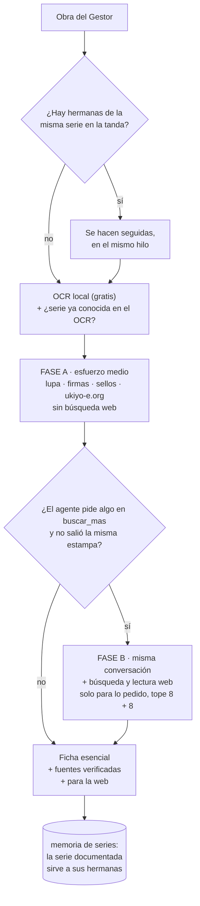

# CATALOGADOR v4 · versión depurada · 09/10/2026

Pedido por la casa el 09/10/2026: aplicar las mejoras propuestas, abaratar, quedarse con lo que
va a la web, construir el título cuando no lo hay, no inventar autor, explicar de dónde sale cada
dato y con qué fiabilidad, y dar las obras vinculadas. **Sin volver a ejecutar contra la API**:
esta versión está probada con 24 pruebas, con una pasada en seco y con los resultados ya guardados.

## Qué sale de cada obra

Seis datos, cada uno con `como` (cómo se identificó, en dos frases), `nivel`, `confianza`,
`fuentes` y `cajas` (dónde está la prueba en la foto):

| Dato | Regla |
|---|---|
| **Autor** | Solo si la firma se lee y se coteja, o lo da una ficha documentada. Si no, vacío: no hay «escuela de» ni atribuciones por estilo. |
| **Título** | El documentado; si no hay, **construido** en castellano por análisis visual (tema, personajes, lugar; en kabuki «El actor X en el papel de Y») y marcado como construido. |
| **Serie** | Del cartucho o de una ficha, con número de lámina si se lee. |
| **Editor** | Del sello cotejado en la base, o de una ficha. |
| **Censor y fecha** | La lectura del sello y la fecha que da; sin sello, por editor, firma o actor, con el método. |
| **Técnica** | Lo que se ve, y el formato por las medidas. |
| **Obras vinculadas** | La misma estampa en otra colección, láminas hermanas, hojas del tríptico, páginas del libro, con URL y relación. |

Se han quitado «pendiente», «requiere libro», estado, notas y las listas de textos y sellos.

### Fiabilidad y qué se publica

La fiabilidad de cada dato la calcula el código, no el modelo:

| Fiabilidad | Cuándo |
|---|---|
| alta | misma estampa en ukiyo-e.org o en un museo; o lectura cotejada con confianza alta |
| media | lectura cotejada; otra lámina documentada; marchante |
| baja | lectura sin cotejar; título construido; hipótesis |

Va a la web (`catalogador.py exportar`, columna por dato y su fiabilidad):
- autor, serie, editor y fecha **solo con fiabilidad alta o media**; si no, vacíos;
- el título **siempre**, con la marca de construido;
- la técnica y el formato, siempre;
- el «cómo» de cada dato publicado, las fuentes **verificadas** (abiertas o de base documentada; nunca las vistas solo en el buscador) y las vinculadas.

`exportar` deja `para_web.csv` con referencia, id de la tienda y SKU. **No escribe en la tienda**: lo carga el Gestor por su puerta.

## Cómo abarata



| Palanca | Qué ahorra |
|---|---|
| **Fase B solo cuando se pide** | La búsqueda web era el 13 % del coste y buena parte de la entrada sin caché (las páginas leídas). Ahora solo entra cuando el agente dice qué resolvería, y nunca si ya salió la misma estampa. |
| **Esfuerzo medio** en lugar de alto | Menos razonamiento de salida (la salida era el 22 % del coste). |
| **Ficha corta** | Sin listas de textos ni sellos: mucha menos salida. |
| **Memoria de series** | Una serie documentada se pasa a sus hermanas en el mensaje, y no se vuelve a buscar. Reconoce la serie por su título japonés en el OCR, que lo lee bien. |
| **Agrupar por serie** | Las hermanas se hacen seguidas, en el mismo hilo: la primera documenta y las demás aprovechan. |
| **Topes más bajos** | Lupa 10, firmas 5, sellos 6, ukiyo-e.org 3 búsquedas y 4 fichas; web 8 y 8. |
| **OCR sin basura** | Los bloques de □ y letras latinas sueltas no se mandan. |

**Coste estimado, sin medir todavía**: fase A sola, 0,25–0,35 € por obra; con fase B, 0,55–0,75 €.
Si un tercio pide fase B, la media sale en torno a **0,35–0,45 €**, frente a 0,57 € de la v2 y
0,86 € de la v3 en obras difíciles. En tandas con muchas hermanas de serie, menos. Hay que medirlo
con la misma muestra antes de darlo por bueno.

## A qué hora

**De 06:00 a 13:00, hora de Madrid**, con `--hasta 13:00`:

- **ukiyo-e.org** está en Estados Unidos: de 06:00 a 13:00 en Madrid es de medianoche a las 07:00 en Nueva York. Es su hora de menos tráfico, y el sitio ya se consulta despacio a propósito.
- **El NAS** hace la copia del Gestor a las 03:00 y la orden de la noche de la tienda desde las 03:00. Empezar a las 06:00 deja ese tramo libre. Recuérdese que el NAS se cortó unos segundos durante la v3: ahora se espera y se repite.
- **La API de Anthropic** cuesta lo mismo a cualquier hora.
- **Ritmo**: ukiyo-e.org a 20–35 s por petición y unas 5 peticiones por obra da unas 20 obras por hora. El tope de 400 peticiones al día de `ukiyoe.py` deja unas **80 obras por día**. Las 299 estampas japonesas sin identificar caben en cuatro mañanas.

Para programarlo en el Programador de tareas de Windows, una tarea diaria a las 06:00 que ejecute en la carpeta del proyecto:

```bash
./.venv/Scripts/python.exe catalogador.py catalogar --lista piloto/sin_identificar_todas.csv --hasta 13:00
```

(La lista de las 299 se genera cuando la casa decida lanzarlas; hoy no se ha generado ni programado nada.)

## Qué porcentaje de error tenemos

Lo que se puede medir es **desacuerdo con el Gestor**, no error, porque el Gestor también se
equivoca: TDP-007990 es de Kunisada y no de Hokushū, y las tres láminas de Hauta tora no maki son
con mucha probabilidad de Echizenya y no de Ōmiya, según la ficha del MFA de la lámina nº 1.

Sobre la muestra normal de 50 (v2, `catalogador.py informe --carpeta claude-sonnet-5-5_v2 --lista piloto/muestra.csv`):

| Dato | Desacuerdo con el Gestor | Lectura |
|---|---|---|
| Autor | 3 de 50 (6 %) | Uno de los tres es error del Gestor: error real ≤ 4 %. Con confianza alta, 1 de 40. |
| Serie | 0 de 27 (0 %) | Cuando el Gestor tiene serie, siempre coincide. |
| Fecha (±2 años) | 1 de 50 (2 %) | |
| Editor | 11 de 44 (25 %) | El punto débil. Parte son errores del Gestor; el error real está entre el 10 y el 25 %. En la v4 un editor sin cotejar **no se publica**. |
| Título | no medible | El Gestor tiene títulos en tres lenguas y descriptivos; la mitad coinciden a grandes rasgos. Desde la v4, el construido va marcado. |

Sobre las 13 difíciles o discutidas de la v3, escogidas a propósito entre las peores, el desacuerdo
en autor es 5 de 11, pero dos de esos cinco son errores probados o muy probables del Gestor. No es
una muestra representativa.

**El error real solo se sabe con un conjunto de oro**: unas 50 obras adjudicadas por una persona
con la obra delante. Es la mejora pendiente más importante, y la revisión humana que ya tiene el
Gestor es el sitio natural para hacerla.

## Órdenes

```bash
./.venv/Scripts/python.exe catalogador.py catalogar --en-seco
```
Grupos por serie, obras por hacer y coste estimado. No llama a la API.

```bash
./.venv/Scripts/python.exe catalogador.py catalogar --lista piloto/sin_identificar.csv --hasta 13:00
```
La tanda real (no se ha ejecutado). Repetible: no rehace lo que ya tiene resultado salvo con `--repetir`.

```bash
./.venv/Scripts/python.exe catalogador.py exportar
```
`resultados/v4/para_web.csv`, lo publicable.

```bash
./.venv/Scripts/python.exe catalogador.py informe --lista piloto/muestra.csv
```
Desacuerdo con el Gestor por dato y fiabilidad, coste, fase B y fuentes.

```bash
./.venv/Scripts/python.exe revision.py
```
`resultados/v4/revision.html`: foto con recuadros de color, los seis datos con su cómo y su fiabilidad, lo que iría a la web, vinculadas y tienda.

## Ficheros

| Fichero | Qué hace |
|---|---|
| `catalogador.py` | Órdenes, acceso al Gestor en solo lectura, agrupación, hora límite, informe y exportación. |
| `agente.py` | Herramientas, fases A y B, verificación de fuentes, coste. |
| `ficha.py` | Los seis datos, la fiabilidad, lo publicable y la memoria de series. |
| `medir.py` | Comparación con el Gestor. |
| `revision.py` | La página de revisión. |
| `ukiyoe.py`, `firmas.py`, `sellos.py`, `imagen.py` | ukiyo-e.org con educación, las bases de firmas y sellos, las mejoras de imagen y los recuadros. |
| `piloto/prompt.md` | El prompt, mucho más corto. |

Se ha retirado `piloto.py`; sus funciones están repartidas en los ficheros de arriba.
