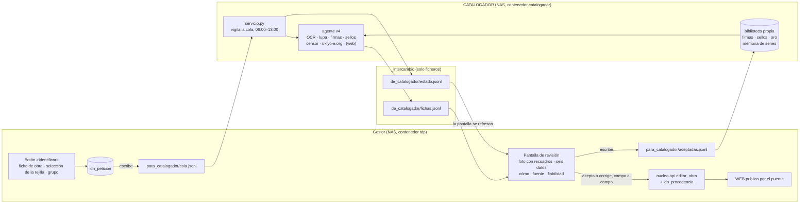

# Integración con el Gestor · 09/10/2026

La casa, el 09/10/2026: el objetivo es trabajar desde el Gestor, cargarlo en el NAS, poder elegir
una obra o un grupo para identificar, y construir una base propia de firmas, sellos, editores y
censores. Autoriza la enmienda a la arquitectura y la ampliación de topes, y sitúa este frente con
compras y márgenes.

## Cómo encaja

El Gestor no llama a ningún LLM ni a ninguna API externa con datos de la casa (ARQUITECTURA §8.4),
y los programas separados se hablan solo por ficheros en `_intercambio` (§7), como FOTOS. Por eso
CATALOGADOR sigue siendo un programa aparte, en su propio contenedor en el NAS, y el Gestor gana un
módulo pequeño, IDENTIFICACION, que pide, enseña y guarda lo que una persona acepta.

## Lo que ya está construido en CATALOGADOR (este repositorio)

| Pieza | Fichero | Estado |
|---|---|---|
| Contrato de intercambio: `cola`, `aceptadas`, `estado`, `fichas`, con ejemplos | `contratos/intercambio/` | Hecho; copiado idéntico al Gestor. |
| Modo servicio: vigila la cola, agrupa, escribe estado y fichas, aprende de lo aceptado, hora límite, idempotente | `servicio.py` | Hecho y probado con un doble del agente (sin API). |
| Biblioteca propia: firmas y sellos confirmados con recorte; conjunto de oro | `biblioteca.py` | Hecho. El agente la consulta antes que las bases de ukiyoesig.net. |
| Datación por censor como código | `censor.py`, herramienta `datar_censor` | Hecho. |
| Contenedor para el NAS, con el OCR dentro y la clave como secreto | `Dockerfile`, `docker-compose.yml` | Escrito, **sin probar**: en el PC no hay Docker. Se construye en el Container Manager del NAS. |

Lo que una persona acepta en el Gestor vuelve por `aceptadas.jsonl` y alimenta tres cosas: la
biblioteca propia (firma y sellos con su recorte), la memoria de series y el conjunto de oro con el
que se mide el error real.

## Lo que queda por construir en el Gestor (por su proceso de etapas, con PARADA)

Módulo nuevo **IDENTIFICACION** (`idn_`), que depende de NÚCLEO. Tres tablas y seis rutas, dentro
del cupo general; no toca el cupo del NÚCLEO. Plan detallado en `docs/PLAN_IDENTIFICACION.md` del Gestor.

| Etapa | Qué | Tablas y rutas |
|---|---|---|
| 0 | Enmienda firmada y aplicada; contrato copiado; guardianas acotadas por una persona | — |
| 1 | Pedir: botón en `ficha_obra.acciones`, `rejilla_obras.acciones_seleccion` y ficha de grupo; `idn_peticion`; escribe `cola.jsonl`; lee `estado.jsonl` y pinta el estado | 1 tabla, 2 rutas |
| 2 | Revisar: lee `fichas.jsonl` a `idn_propuesta`; pantalla con la foto y los recuadros, los seis datos con su cómo, fuente y fiabilidad; aceptar o corregir campo a campo; `idn_procedencia`; escribe en la obra por `editar_obra` y en `aceptadas.jsonl` | 2 tablas, 3 rutas |
| 3 | Publicar: los campos aceptados entran en la lista de WEB; `/salud` dice si se ve `de_catalogador` y de cuándo es la última ficha | 1 ruta |

## La base propia de firmas, sellos, editores y censores

Hoy el sistema coteja contra listas ajenas: 3.456 firmas y 4.020 sellos de ukiyoesig.net, y la
tabla de censores como código. La casa quiere la suya. Lo que falta, por orden:

1. **Que se llene sola** (hecho en este repositorio): cada firma y cada sello que una persona confirma en la pantalla de revisión se guarda con su recorte, su lectura y su nombre. Es la base de la casa, con sus propias fotos, y el agente la mira primero.
2. **Cotejo por imagen, no solo por texto.** Comparar el recorte de un sello con los recortes guardados y con las imágenes de los 4.020 sellos de ukiyoesig.net. Hace falta descargar esas imágenes una vez, despacio, y un índice visual local (DINOv2 u ORB, en CPU). Resuelve los sellos que no se leen. Es una etapa de CATALOGADOR.
3. **Censores con imagen.** Una tabla de los sellos de censor con su imagen (los nanushi de 1842–1853 y los aratame), para que la lupa coteje la forma y no solo el carácter.
4. **Editores con sus datos.** Para cada editor confirmado, nombre, kanji, lugar, años, sus sellos documentados y las obras del taller donde aparece. Sale de la biblioteca cruzada con ukiyoesig.net y con las fichas de museos que ya cita el agente.
5. **Una pantalla en el Gestor** para hojear y corregir la biblioteca (etapa 4 de IDENTIFICACION, cuando las tres primeras estén en uso).

## Dónde corre y a qué hora

En el NAS, en su contenedor, con dos carpetas compartidas con el Gestor: las imágenes en solo
lectura y `_intercambio`. La clave de la API es un secreto de Docker, nunca una variable del
compose. Atiende la cola de 06:00 a 13:00 (`--hasta`), cuando ukiyo-e.org tiene menos tráfico y el
NAS ya ha hecho sus copias; fuera de ese tramo deja las peticiones «aplazadas» y las retoma al día
siguiente. Hasta que el contenedor exista, el servicio se puede lanzar desde este PC apuntando
`TDP_INTERCAMBIO` e `TDP_IMAGENES` al NAS: el contrato es el mismo.
